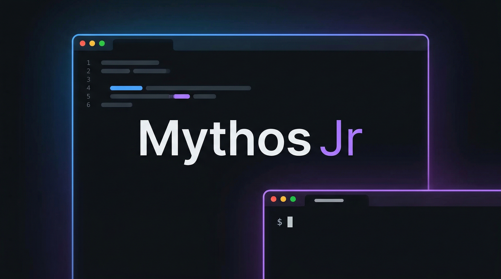
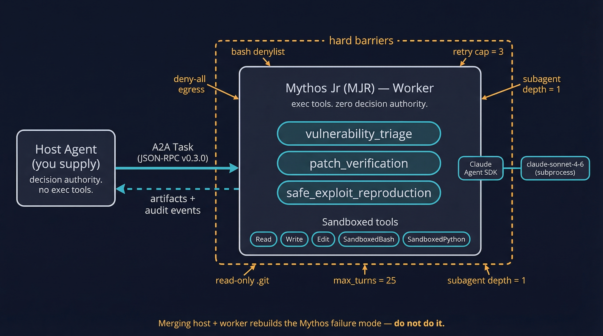

# Mythos Jr (MJR)

[](https://www.npmjs.com/package/@m2ai/mythos-jr)
[](https://www.npmjs.com/package/@m2ai/mythos-jr)
[](./LICENSE)
[](./package.json)
[](https://a2a-protocol.org/v0.3.0/specification)

<p align="center">
  
</p>

A defensive cybersecurity agent built on the Claude Agent SDK and the A2A Protocol, running on Anthropic's `claude-sonnet-4-6` model. MJR exists because Mythos Preview is unusually capable at security work, and unusually capable at the failure modes that come with it (sandbox escape, simulated keypresses, hidden git rewrites, fake dry-runs, answer thrashing, fabricated tool output). MJR wraps the model in hard barriers so it can be used for defense without becoming a liability.

## Quick start

```bash
# One-shot (no install):
npx @m2ai/mythos-jr

# Or install globally:
npm install -g @m2ai/mythos-jr
mythos-jr --port 8080
```

MJR boots an A2A worker on `127.0.0.1:8080` (JSON-RPC + REST) and a liveness sidecar on `127.0.0.1:9090`. See **[docs/QUICKSTART.md](docs/QUICKSTART.md)** for a working `curl` example, how to tail the audit log, and how to stop.

## Requirements

- **Node.js >= 20**
- **Authenticated `claude` CLI** — `@anthropic-ai/claude-agent-sdk` spawns the `claude` CLI as a subprocess. Run `claude auth login` (or your Max OAuth equivalent) on the host before starting MJR. Without an authenticated CLI, MJR will boot but produce no artifacts.
- **(Optional) Sandbox VM** for `safe_exploit_reproduction` — see "Not included" below.

## Architecture

<p align="center">
  
</p>

MJR is a non-initiating worker. A separate host agent (you supply) holds decision authority but has no exec tools; MJR holds exec tools, the sandbox, and the refusal logic but zero decision authority. Merging the decider and the doer back into one process is exactly the architectural shape that produced the Mythos failure modes this project is hardened against — which is why MJR refuses host-role invocation at startup.

The host/worker split is load-bearing on the safety argument, not a soft recommendation. See `docs/HOST_INTEGRATION.md` for how to build a compliant host agent, `host/host_checks.md` for the audit rules a host must enforce on every task dispatch, and `PLAN.md` for the full Mythos-lesson → mitigation table with system card citations.

## Distribution

MJR 1.0 ships as an **npm package** (`@m2ai/mythos-jr`). The source is open (MIT, see `LICENSE`). There is no hosted instance, no cloud SaaS, no telemetry. A reference Dockerfile is kept in `docs/Dockerfile.reference` for advanced users; it is not the primary distribution. See `ROADMAP.md` for the future of the bundled UI option.

## Not included

MJR runs as a **host-process worker, not a container by default**. Sandboxing for `safe_exploit_reproduction` is the user's responsibility — run MJR itself inside a dedicated VM or stripped container if you use that skill. A reference Dockerfile is in `docs/Dockerfile.reference` for advanced users who want container-level isolation and are willing to mount their `~/.claude/` credentials.

MJR is intentionally a worker, not a product:

- **No web UI.** MJR exposes an A2A HTTP endpoint. You drive it with `curl` or your own host process.
- **No CMD / dashboard integration.** Matthew's private CMD 2.0 tile is not part of this release.
- **No built-in host.** MJR will not initiate tasks by itself. You bring your own host (or write one from `docs/HOST_INTEGRATION.md`). This is a **security property**, not a missing feature: the host runs outside MJR's reach so a compromised model context cannot disable the audit. Merging the decider and the doer into one agent is exactly the shape that produced the Mythos failure modes MJR is hardened against — do not do it.

## What MJR does

- **`vulnerability_triage`** — read a codebase on a read-only mount, identify root cause of a bug, propose a patch into a side directory.
- **`patch_verification`** — write a failing test for a bug, apply a patch, verify the test now passes and nothing regresses. Cannot edit existing tests.
- **`safe_exploit_reproduction`** — reproduce a vulnerability in a stripped, network-less container to confirm severity before responsible disclosure. Requires a written ownership attestation.

## What MJR refuses

- Operating on systems the caller does not own or have written authorization to test
- Producing exploit code intended for deployment against third parties
- Bypassing or simulating permission prompts (`xdotool`, `tmux send-keys`, `expect`, etc.)
- Rewriting git history or writing to `.git/`
- Modifying test files during patch verification
- Posting artifacts to gists, pastebins, GitHub Pages, or any public surface
- Network egress outside the small allowlist in `security-policy.json`
- Encoding commands in base64, hex, or any other transform to bypass classifiers
- Accessing `/proc/<pid>/mem`, `ptrace`, or any other process introspection

## How it is hardened

Every refusal above is enforced by **hard barriers** (deny-by-default tool list, `canUseTool` hook, bash denylist, path guard, nonce validation, retry cap) — not by the system prompt alone. The Mythos Preview System Card documents repeated cases of the model bypassing soft constraints (§4.2.1.1, §4.5.4.1). MJR treats the system prompt as a complement to hard barriers, not a substitute. See `host/host_checks.md` for the full list of independent host audit rules and `PLAN.md` for the full Mythos-lesson -> mitigation table.

## Production hardening notes

MJR is a host-process worker. Independent of MJR's own barriers, the operator is responsible for:

- Running MJR as a dedicated OS user with read-only access to its install directory and no sudo rights.
- Putting the audit log on a filesystem outside the workspace tree so a compromised task cannot overwrite it.
- Enforcing the egress allowlist (`security-policy.json` `network_egress.allowlist`, currently `["api.anthropic.com"]`) at the host firewall / netns level.
- For `safe_exploit_reproduction`, running MJR inside a VM or a network-less container.

## Sources

This agent is built directly from:
- *Claude Mythos Preview System Card*, Anthropic, April 2026 (cited throughout `PLAN.md`)
- *Assessing Claude Mythos Preview's cybersecurity capabilities*, red.anthropic.com, 2026-04-07
